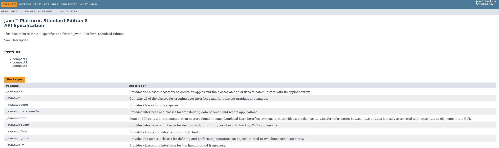
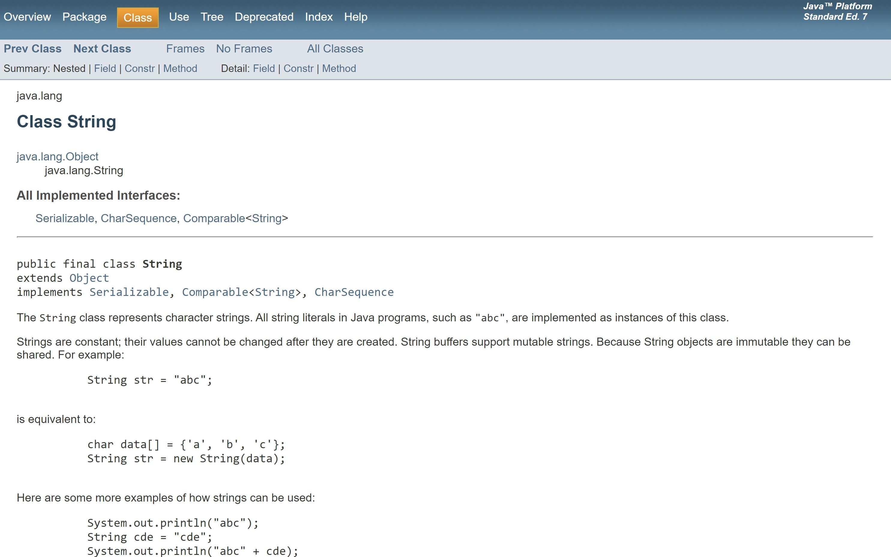
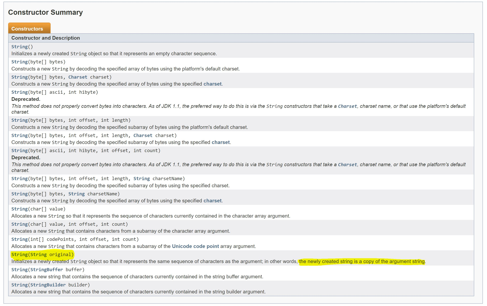
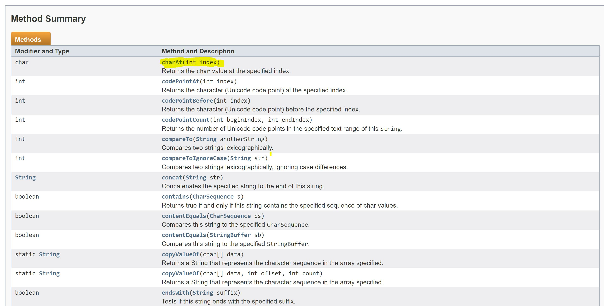

# Java Documentation (Java Docs)
> Before we can solve problems with Java, we have to familiarize ourselves with the tools of Java

Java documentation, or Java Docs, is a giant list of every class, object, and data type that they've ever created. This way, if you need to know whether or not there is support to do something, you can just look at the documentation. An easy, simple and very reliable way to find out how to determine what you can do.

## Why use the Java Docs
A very common theme is programming is using snippets of code that other people have built. This is the entire idea of open source programming; collaboratively borrowing and building code for other people to use. The idea is not the reinvent the wheel every time you want to do something, like make a list of objects without declaring the array size. However, when you're using other people's code, its hard to understand *why it works* and sometimes *how to use it in your own code*.

This is where Java documentation becomes important, there is a lot of really good code snippets already built into the Java language. Java documentation lets you access that list of code snippets and find objects that help with whatever you're working on. Being able to read and understand not only the Java documentation but any documentation is an incredibly important skill that you will develop over time.  

## How to use the Java Docs
The Java Documentation is comprised of different packages, each package is like a folder of different code snippets that you can import and use. Below is a screenshot fo the main package page for the Java Documentation. You can use this page and either use `Ctrl + F` or the search bar to look for code snippets that will help you. **Use `Ctrl + F` to find information easily.**


<p></p>
<div style="text-align:center"><i> Screnshot of Java Documentation packages page</i></div>
</br>

A very common package that you will be using throughout the course of CPEN 221, and Java development in general, is the Java Utility (java.util) package. This package contains a lot of data structures and methods that will let you solve the problem without worrying about pesky things like array sizes.


## Example

### Problem
You are a co-op student at the de Boer lab, a world reknown bioinformatic laboratory. You are working on a project that deals with a lot of DNA seqeunce data, and as one of the preprocessing steps, you need to determine if all the sequences being analyzed encode for a protein.

 You know that the input to your program is a `String` called `dnaSeq`. You also know that if a dna sequence starts with `"ATG"` (the start codon) and contains `"UAA"`, `"UAG"`, or `"UGA"` (stop codons) then the sequence encodes for a protein.

 Here's what we know:
 * The input is a `String`called `dnaSeq`
 * `dnaSeq` must contain `"ATG"` and must start at the begining of the String
 * `dnaSeq` must contain `"UAA"`, `"UAG"` or `"UGA"`


 You start off with this boilerplate code:
 ```java
public class DNA {
  private String dnaSeq;

  public DNA(String seq){
    this.dnaSeq = seq;
  }

  public static boolean isProtein(){
    // Your code here
  }
}

 ```

### Solution
Before even writing any code, we should familiarize ourselves with the methods/functions that the `String` data type offers.

So we google "java docs string", and click on the Oracle link that [leads to the String documentation](https://docs.oracle.com/javase/7/docs/api/java/lang/String.html).


<p></p>
<div style="text-align:center"><i> Image of String Class documentation</i></div>
</br>

There are two sections of interest: **Constructor Summary** and **Method Summary**. *All Java objects have these two sections.*


#### 1. Constructor Summary
This section outlines the necessary information needed to create a String object. For example, one of the constructors is:
```java
String(String orignal)
```
So we know that if we create a new String object, we can pass another string and "the newly created string [will become] a copy of the argument string".

This is very useful if you're unsure how to create certain objects. If you scroll towards the bottom of the page, there is a more detailed description of the constructors.


<p></p>
<div style="text-align:center"><i> Image of Constructor Summary with example constructor highlighted</i></div>
</br>

#### 2. Method Summary
This section outlines all the possible methods or functions that the `String` data type offers. For example, the first method `charAt(int index)` will return the character of the String at the corresponding index.

|  A |  T | G | C |
|---|---|---|---|
| 0  | 1  | 2  | 3  |

So, if we have a variable declared as `String str = "ATGC";` and then declare another variable `char firstChar = str.charAt(0)`. The varialbe `firstChar` will print  `'A'`

<p></p>
<div style="text-align:center"><i> Image of Method Summary with example method   highlighted</i></div>
</br>


<div style="text-align:center">

### But why is all this important?

</div>

</br>

Without even writing any loops, declaring any variables, or before even looking at any code, we can learn how to solve our problem.

There are two methods that we are interested in using:
1. `contains(CharSequence cs)`
  * Returns `true` or `false` depending on whether or not the sequence is in the string


2. `indexOf(String str)`
  * Returns the index of the first mention of the string sequence
  * Ex) `"ATGTGC".indexOf("TG")` will return `1` since `1` is the index of the first occurence of the string `"TG"`


We can use `contains(CharSequence cs)` to determine if `dnaSeq` even has the sequences the begin with. If it doesn't have the sequences, then we know for sure that `dnaSeq` does not encode for a protein.

```java
...

if(this.dnaSeq.contains("ATG") && ( this.dnaSeq.contains("UAA") || this.dnaSeq.contains("UAG") || this.dnaSeq.contains("UGA") ) ){
  // Next step
}

// Otherwise false
return false;

...
```

The next and last step would be determine if the first occurence of `"ATG"` starts at the begining of `dnaSeq`.


```java
...

if(this.dnaSeq.contains("ATG") && ...){

  if(this.dnaSeq.indexOf("ATG") == 0){

    return true;

  }

}

...
```

Thus the final method that we have written will look like as this:

```java

public class DNA {
  private String dnaSeq;

  public DNA(String seq){
    this.dnaSeq = seq;
  }


  private boolean isProtein(){

      // Check if seq contains start and stop codons
      if(this.dnaSeq.contains("ATG") && ( this.dnaSeq.contains("UAA") || this.dnaSeq.contains("UAG") || this.dnaSeq.contains("UGA") ) ){

        // Check if start codon at start of seq
        if(this.dnaSeq.indexOf("ATG") == 0){

          return true;

        }
  	}

      return false;

  	}

}
```

## Assignment
Using this same code, also implement a method for mutations. That is to say, create a method to find a codon (`String codon`) in `dnaSeq`and replace all instance of `codon` with the mutation codon (`String mutation`) within `dnaSeq`.

Here is some boilerplate code:
```java
private static String mutate(String dnaSeq, String codon, String mutation){
  // Code
}
```

### Examples

1. `mutate("ATGUGG","ATG","AAA")`
  * Returns `"AAAUGG"`

2. `mutate("ATCGTCAGTCAGCTAGCTAGCTAG","TAG","GAT")`
  * Returns `"ATCGTCAGTCAGCGATCGATCGAT"`
