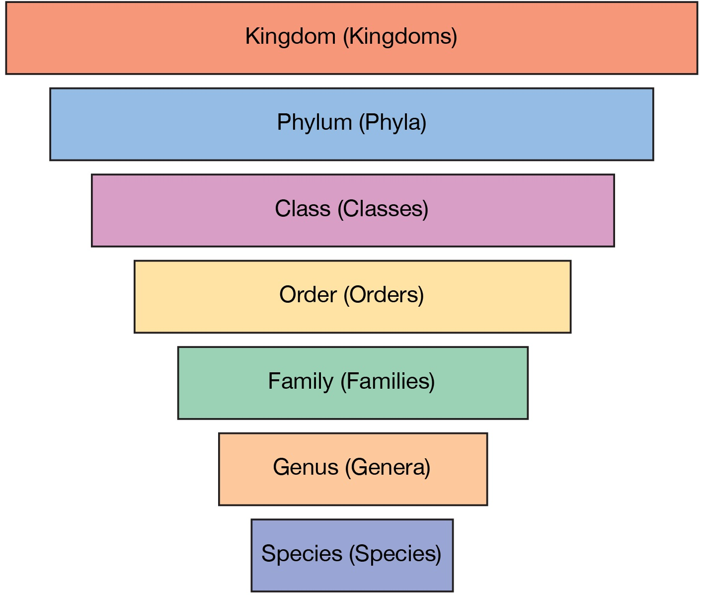

Inheritance is a feature of object oriented programming languages. It is a way to derive one class from another. Often, it is useful to visual inheritance as a hierarchy or a tree if they get very complex.

As with most things, an example of inheritance would be very useful. A basic one could be the animal kingdom. At the top of our hierarchy is the `Animal` type. Next, a type called `Mammals` would inherit from `Animal`, then `Chordate` would inherit from `Mammals`, on and on until you finally have a specific species that inherits from a genus. The vocab for this is superclass and subclass. `Animal`, is a superclass of `Chordate`, and `Mammals` is a subclass of `Chordate`

Another example could be `MyPetDog` from earlier. You might want to create a class called `MyPetChihuahua` that has some unique methods or variables that `MyPetDog` does not have (say, `private int anger`). Instead of recreating everything from scratch, you can just inherit your old methods. When inheriting from a superclass, the subclass  receives every instance variable and method.
