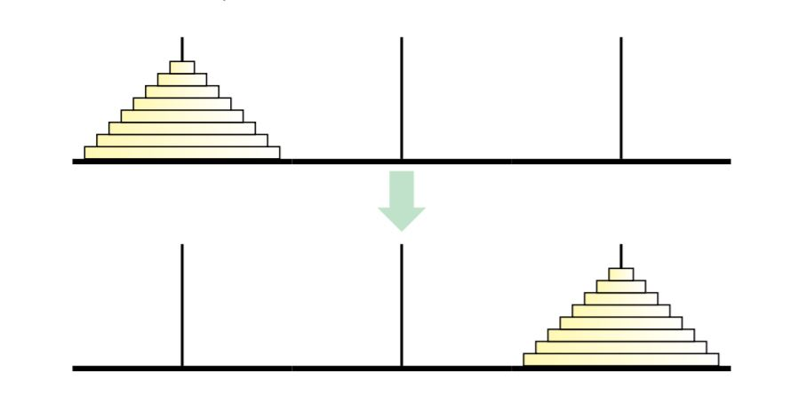

# What is Recursion

Recursion is simple, consider the following statement:

> In order to understand recursion, one must understand recursion

Ok, that's the entire lesson.

Just kidding, there is a little more to recursion than just that. However, this joke about recursion illustrates the key essence of recursion. **Recursion is when you call your program, in your program.** This might not make immediate sense, but another way to look at recursion is breaking a large problem into a smaller one. This will make more sense when I introduce an example but for now, think about it like solving one simple problem several times.

**Recursion is a type of problem reduction**, by breaking a very large problem into a set of small ones. Thus, we can think of something as recursive when it consists of smaller constituents or parts.

## Recognizing Recursion
An example of recursion in nature is the idea of a tree branch. A tree branch consists of a stem and a set of other smaller branches. These smaller branches also have a stem and even more small branches, and so on and so forth. Blood vessels or rivers also hold a similar pattern.

<p align="center">

</p>
<p align="center">Examples of recursive entities <a>(Introduction to Recursive Programming, 2017)</a></p>


### Example 1: Factorial
Recall the  mathematical operation of factorial. One can compute the factorial of a number by computing the product of all positive integers less than and equal to that number.

Eg)  
* 5! = `5 * 4 * 3 * 2 * 1` = 120

* 1! = `1` = 1

One property of factorial is:
* 5! = `5 * 4!` = `5 * 4 * 3!` and so on

Let's use the idea of recursion to solve this, first we must identify the complex problem. The complex operation in our case is `n * (n-1) * ... 2 * 1`, a series of multiplication.
So, lets break this complex operation down into more simple operations. At the most basic level, the most simplest operation is multiplying a number with the factorial of the number that comes before it. Thus (We will use python):

```py
def factorial(n):
  return n * factorial(n-1)
```

Pretty simple, right? Well, something you'll notice when you try to use this code is that it will go on forever. That's because it doesn't know when to stop. Thus, since we know that negative factorials are not defined, we can stop at `n = 1`. Thus:

```py
def factorial(n):
  if n == 1:
    return 1
  else:
    return n * factorial(n-1)
```

That's it! Simple, sweet, and elegant.

### Example 2: Tower of Hanoi (Optional)
<p align="center">This example is more advanced and if it doesn't make complete sense, then ignore it.</p>

If you're not familiar with the Tower of Hanoi, its a puzzle published by the French teacher and mathematician, Edouard Lucas. In that puzzle, there are three rods with one of the rods having a number of different diameter disks stacked on it. The goal is transfer the stack of disks from one end to the other **without stacking a larger disk on top of a larger one**.

[Play the game here to get an idea](https://www.mathsisfun.com/games/towerofhanoi.html)

<p align="center">

</p>
<p align="center">Tower of Hanoi with start case (<b>Top</b>) and desired end case (<b>Bottom</b>)</p>

> I will borrow the solution from Dr. Jeff Erickson's take on this problem

Okay, let's use the idea of recursion again. Instead of trying to solve the entire puzzle at once, let's focus on one simple step. Our complex operation is to move all the disks from one side to the other but not putting a large disk on a smaller disk.

The most simple operation that we can do is *move the largest diameter disk* to the other side. We can't do this at this first since so many other disks are in the way. So, we try to move the *next largest diameter disk* to the spare placeholder rod (the middle one). We essentially construct the entire stack of disks again, **minus the largest disk**, in the middle. It will look like this:

<p align="center">

</p>

Now we can move the largest diameter disk to the other side. That's it, we're done. Once we've defined this simple operation, move the largest disk to the other side and move anything in the way to the spare placeholder rod, we are done the program.

Remember how in example 1 the program would run forever if we didn't specify an exit condition, well we also need to specify an exit condition here. The exit condition in our case is if there are no more disks (n = 0; where n is number of disks)

Thus, the code will look like this:

```py
def towers_of_hanoi(n, src, dst, tmp):
  # n is the number of disks
    if n > 0:
        towers_of_hanoi(n-1, src, tmp, dst)
        print("Moving disk from", src,"to", dst)
        towers_of_hanoi(n-1, tmp, dst, src)
```


If you feel as though this explanation doesn't make too much sense, check out [Jeff E's notes on recursion](http://jeffe.cs.illinois.edu/teaching/algorithms/book/01-recursion.pdf). He goes into a lot more detail about recursion in general.

## Assignment
Your job is to write a recursive function for creating the Fibonacci sequence. If you are unfamiliar with the Fibonacci sequence, the n-th element in the sequence is the sum of the previous two elements (`n-1` + `n-2`).

Eg) 1, 1, 2, 3, 5, 8, 13, 21, 32, 55 ...

For example, the sixth term (8), is the sum of the fifth term (5) and the fourth term (3). Every single element is the sum of the previous two elements.

**TODO:** Implement the Fibonacci sequence in Java (or some other programming language).

### Deliverables
* Programming file of Fibonacci code
