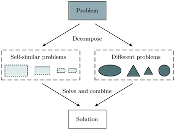
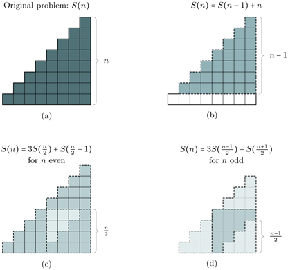

# Thinking Recursively
Generally, when you are programming recursive code, your main task will consist of creating your own recursive definition, defining a good base case, and making sure the recursive code is moving in the correct direction. To help in these tasks, its useful to think about several strategies. A lot of strategies go back to thinking of recursion as solving one simple case of a complex problem.

Another strategy to thinking about recursion is to use the mathematical idea of **induction**. Some of you may have been introduced to the idea of induction. For those who have not, induction is a proof method in which in order to prove that any given case is true, the next case must also be true. If you don't get it, don't worry its not too important but if you would like to know more please read the optional lesson on induction.


We will also reference the steps that you should follow when writing recursive code here. It might help you debug parts of your program in addition to some of the strategies here

1. **Break the problem you are trying to solve, into a simpler one**, even if its only one step simpler

2. **Believe that your function will solve the simple problem**. Trust that you can solve this simple problem, like really believe it

3. Now that you can solve the simple problem, **think about how you can solve the more complex one** (if at all, sometimes solving the simple step will solve the complex one via recursion)


## Strategies to Recursion
We will focus on recursive programs that solve computational problems, which means most problems will have an input and output. Thus, think about the following stratagies.

### Decomposing Complexity
<p align="center">

</p>
<p align="center">Flow Diagram Explaining the Decomposition Process <a href="https://learning.oreilly.com/library/view/introduction-to-recursive/9781351647175/">(Introduction to Recursive Programming, 2017)</a></p>

The idea of breaking down complex problems is not one that is exclusive to programming, it is a general problem solving strategy that will be relevant to your academic career as a whole. That being said, being able to decompose problems will be very useful in writing recursive program specifically. A common them in these lessons is **thinking about how to solve a single simple operation**. Once you can solve a smaller case of the problem, we let the program do the rest and solve the more complex version of the problem. Here are some steps to help consider how to write recursive code.

#### 1. Problem
Understand the problem that you are trying to solve, like really understand it. Before we can even begin to start solving the problem, we must understand the properties, behavior, and framework that the problem exists in.

Think back to the examples we did before. In the factorial example, if we only had a basic understanding of factorial that `n! = n * (n-1) * (n-2) ... * 2 * 1` then we would be stuck on the problem for a while since we would be trying to think of a way to get the number before. However, we knew that `n! = n * (n-1)!`, this may seem like a trivial observation but this definition/property of factorial is what makes it recursive and lets us solve it.

#### 2. Decompose
Understanding the problem will give insight into how to decompose the problem. You're probably getting tired of the factorial example, so I will use another example. Suppose we want to compute sum of the first n positive integers. That is to compute `1 + 2 + ... + (n-1) + n` (yeah, i'm not very creative). Let's call this function `S(n)` for notation sake.

Okay, obviously we can say that `S(n) = n + S(n-1)` and define `S(1) = 1` and finish the problem (some of you might even have noticed that you can just compute `(n  * (n-1)) / 2`). But lets explore this idea of decomposing complexity in a bit more detail, even if it makes our solution more verbose. Consider the following graphic:

<p align="center">

</p>
<p align="center">Decompositions of the sum of the first positive integers<a href="https://learning.oreilly.com/library/view/introduction-to-recursive/9781351647175/">(Introduction to Recursive Programming, 2017)</a></p>

When `n` is even, we can fit three right triangles of height `n/2` and one smaller right triangle of height `n/2 - 1`. Conversely, when `n` is odd, we can fit three smaller right triangles of height `n/2 -1` and one large right triangle of height `(n+1)/2`.  To quickly summarize, we notice **two different problems** (when `n` is even and when `n` is odd), after which we notice those different problems were **self-similar problems** that we could break down. Which leads us into the third and final step.

#### 3. Combine and Solve
Now that we have these two definitions, we can combine them and write a concrete solution. **But**, before that, we must think of our base cases. Lets use the smallest positive even and odd integers that we can think of: 1 and 2. The sum of all positive integer until 1 is 1, that is `S(1) = 1` and the sum of all positive integers until 2 is 3, that is `S(2) = 1 + 2 = 3 `. Okay now we have our base cases, lets write the program!

```py
def S(n):
  if n == 1:
    return 1
  if n == 2:
      return 3

  if (n % 2 == 0):
    return 3 * S(n/2) + S(((n/2) -1))
  else:
    return 3 * S(((n-1)/2)) + S((n+1)/2)
```

### Trusting the Natural Recursion
You might have heard of this saying, a proverb really, at your time at UBC.

> Trust the Natural Recursion

Some of you might not understand what it means, but now that you understand recursion, you can understand this computer science *mantra*. It's simple really, consider the following example.

Suppose you are a worker at an assembly line for manufacturing a gurney, and your job is to attach to attach the wheels to the gurney. You must trust that everyone before you in the assembly job did their job correctly (attach the legs, attach the strap, etc). Likewise, the workers downstream in the assembly line will trust that you did your job correctly. The **only** person who doesn't have to trust anyone before him, is the first worker who places the first part in position.

That's trusting natural recursion. When you write recursive code, the input that your code is receiving will be the product of the code before it, so **trust that your function has done the work properly for those cases**. All you need to do is write the first step and let the rest of the workers do their job.
