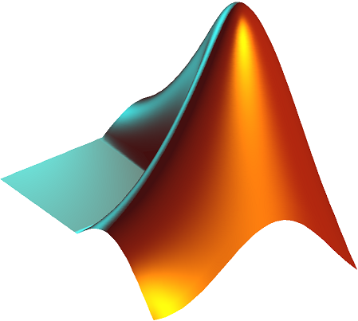

# What is MATLAB

MATLAB is technically a programming language. It traces its origins all the way back to the 1970s, and for some reason is still used today. MATLAB is made by a company called MathWorks, and, as the name implies, is very useful for math. Basically, if you want to plot a function, or do something that is even vaguely related to math, you can probably do it somewhat easily in MATLAB. That is one of MATLAB's strongest features. It is old, and because of this has hundreds of user made packages that can do just about anything, from signal processing to image processing to numerical analysis of PDEs to controll systems. 

MATLAB is sadly going to be a fun part of your degree from now on. A lot of your proffessors have used this language in the past, and they aren't stopping now. In particular, it is used often in BMEG 230, BMEG 371, BMEG 320, BMEG 321 and BMEG 357. All of these course cover different subjects (from biomechanics to PDEs to signal processing), which goes to show how diverse MATLAB can be with is numerous packages.

This final lesson will just go over how to wrangle this language into doing what you want to, and the mindset you should be in when solving problems for it.

As an aside, for your own personal projects Python can replace MATLAB for the most part and is often better, but you should use whatever you are most comfortable with!
